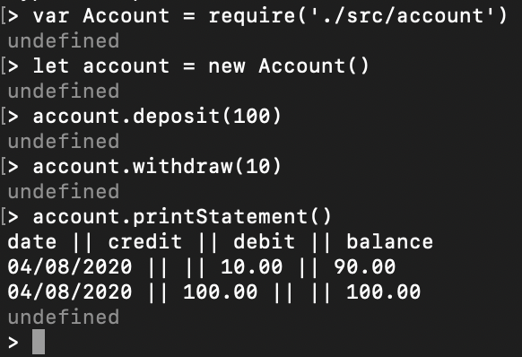

### Bank Tech Test - Node.js

A small project designed to highlight my code quality and process. [source](https://github.com/makersacademy/course/blob/master/individual_challenges/bank_tech_test.md)

It allows you to create an account, deposit, withdraw, and print statements.

## To run 

1. Clone this repo.

2. Install dependencies with:

   ```shell
   npm install
   ```

3. Run tests with:

   ```shell
   npm test
   ```

4. Run the Node REP:

   ```js
   node
   ```

5. Require `account.js`:

   ```js
   const Account = require("./src/account.js")
   ```

6. Create an account with:

   ```js
   let account = new Account();
   ```

7. Use the account with the following methods:

| Method                     | Description                                                                                        |
| -------------------------- | -------------------------------------------------------------------------------------------------- |
| `account.deposit(number)`  | deposit however much you want into your account, this figure is in pounds with pence as decimals.  |
| `account.withdraw(number)` | withdraw however much you want from your account, this figure is in pounds with pence as decimals. |
| `account.statement()`      | prints a statement of all transactions so far                                                      |

 ## Example Screenshot

 
 
 ## To run tests
 - npm test

 ## Approach 
 Decided to that there are three clear classes, the account itself which holds the balance and a record of actions, an action on that account (deposit or withdrawal), and a statement class that would print the statement.
 Followed TDD process using Jasmine, starting with Account, then Account_interaction, and finally statement.
 Used Jasmine's coverage check with istanbul to check coverage.
 Considered using a seperate withdraw and deposit class, however realised they would be the same, therefore decided to have the diserning factor being a positive or negative amount that would be given based on the function called in Account.